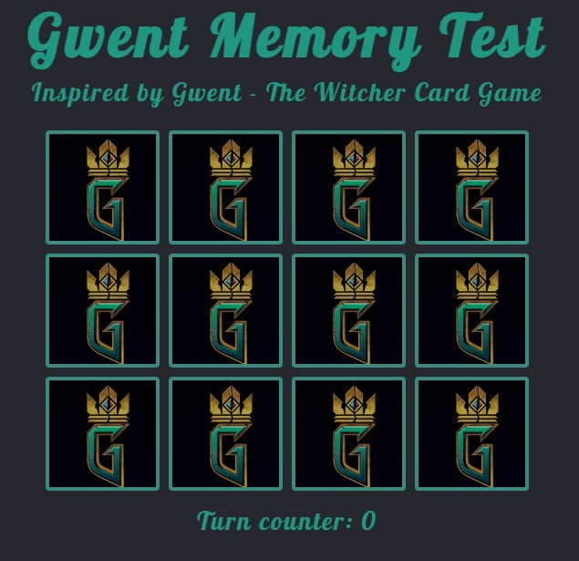

# Mirosław Zelent - Kurs JS / 05. JQuery - MemoryGame

An example of a game from Lesson 5. jQuery of Mirosław Zelent's JavaScript course.
I have made some modifications and code refactoring such as:

- grid and flexbox layout (CSS),
- sorting method - drawing of cards before the game (JS),
- 'for' loop with addEventListener() - getting rid of code redundancy (JS),
- delete bag - clicking twice on the same card increases the turnCounter (JS),
- button - play again (JS).

## Table of contents

- [Overview](#overview)
  - [Screenshot](#screenshot)
  - [Links](#links)
- [My process](#my-process)
  - [Built with](#built-with)
  - [Useful resources](#useful-resources)

## Overview

### Screenshot

### Links

- Live Site URL: https://mateusz-przybyla.github.io/JS-MemoryGame/

## My process

### Built with

- CSS: grid, flexbox
- JavaScript: array, querySelectorAll(), addEventListener(), sort(), setTimeout() methods
- jQuery: .on(), .addClass(), .removeClass(), .html(), .css() methods

### Useful resources

- [Mirosław Zelent - Kurs JS](https://miroslawzelent.pl/kurs-javascript/jquery-gra-w-pamiec/)
- [MDN Web Docs](https://developer.mozilla.org/en-US/)
- [jQuery API Documentation](https://api.jquery.com/)
- [Sorting an Array in Random Order](https://www.w3schools.com/js/js_array_sort.asp)
